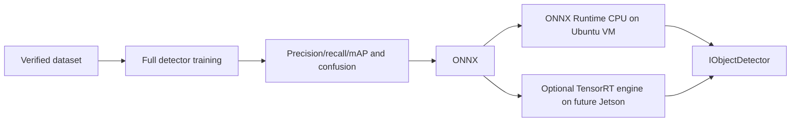

# AI model

The existing 96x96 `tiny-roi-classifier` is preserved as a legacy experimental
classifier. It cannot locate objects in a full frame and is not a production
detector. The new target is a reproducible full-frame lightweight detector with
drone/bird/aircraft classes, exported to ONNX and then TensorRT on Jetson.

Audit correction: `ml/datasets/processed/cc0_yolo_v3` contains YOLO normalized
bounding-box annotations and passes `verify_dataset.py`. It can support a detector
training experiment. No trained full-frame checkpoint or ONNX export is currently
was present at audit time. A deliberately non-production 1-epoch/2%/320px smoke
artifact was subsequently trained and exported to prove the pipeline; its mAP50
is only 0.000472. `UBUNTU_VM_REAL` detection remains blocked on full training and
validation.
The current deployment target is ONNX Runtime CPU on Ubuntu amd64; TensorRT is
future Jetson-only optimization.

