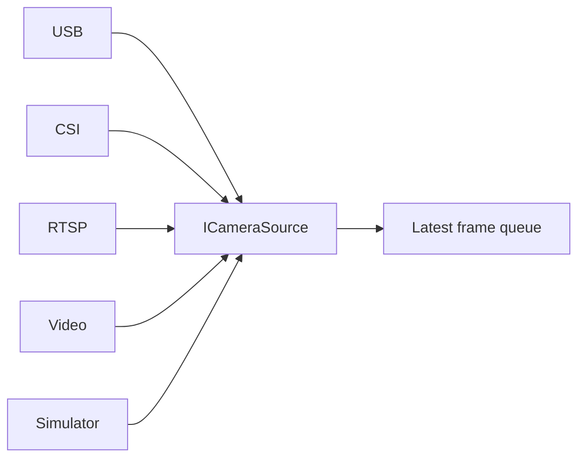

# Cameras

Each source has an independent worker and a capacity-one latest-frame queue.
Overload drops stale frames instead of accumulating latency. Configuration owns
camera ID, sector, type, source, resolution, capture/AI/preview FPS, rotation and
flip. DEV mode implements a simulated source. USB UVC, CSI and RTSP adapters need
their respective hardware/runtime tests.

