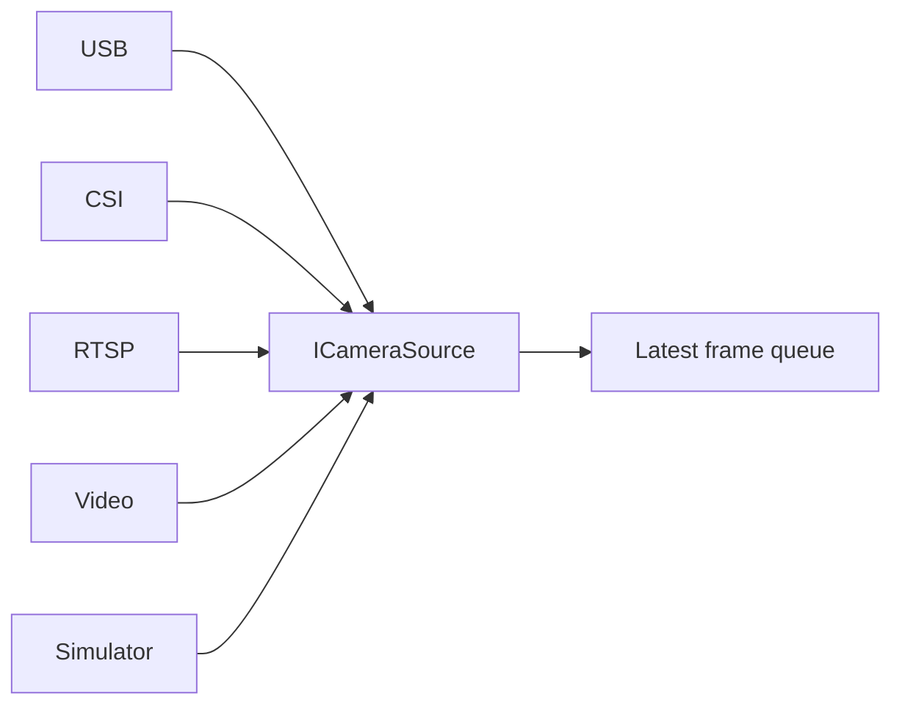

# Cameras

Each source has an independent worker and a capacity-one latest-frame queue.
Overload drops stale frames instead of accumulating latency. Configuration owns
camera ID, sector, type, source, resolution, capture/AI/preview FPS, rotation and
flip. DEV mode implements a simulated source. USB UVC, CSI and RTSP adapters need
their respective hardware/runtime tests.

## Four USB cameras through one Type-C hub

A powered USB 3 hub can carry four UVC cameras through one Mac Type-C port.
VMware must pass each camera into Ubuntu; verify all four devices with
`v4l2-ctl --list-devices`. USB cameras do not receive IP addresses. The server
binds to `0.0.0.0`, while the cameras are selected as stable V4L2 device paths.

For the four-camera baseline, copy
`jetson/configs/ubuntu-usb4.example.yaml` to `/etc/tank/config.yaml`. Its
`source: auto` entries assign `/dev/v4l/by-id/*video-index0` devices in sorted
order and keep each camera ID/sector stable across reconnects. Use a powered hub,
avoid uncompressed high-resolution YUYV on all four cameras, and begin at
640x480/10 FPS; raise settings only after measuring USB bandwidth and CPU use.

The ESP32-S3 remains a separate USB-serial device. It controls only its sensor
and LED GPIOs; Ubuntu owns camera capture, ML inference and the indicator
decision. Its SoftAP exposes node telemetry, not the camera JPEG stream.
