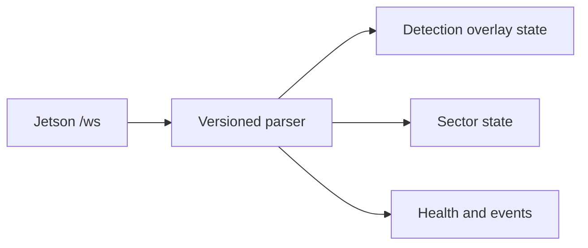

# Flutter console

The existing macOS/Windows/Android application is extended in place. It connects
to `ws://127.0.0.1:8081/ws`, reconnects with delay, isolates malformed packets,
parses detections/bounding boxes/range/sector/health/events and updates the sector
chips and event list. Camera tiles remain offline placeholders until a preview
transport (MJPEG/WebRTC) is selected.

