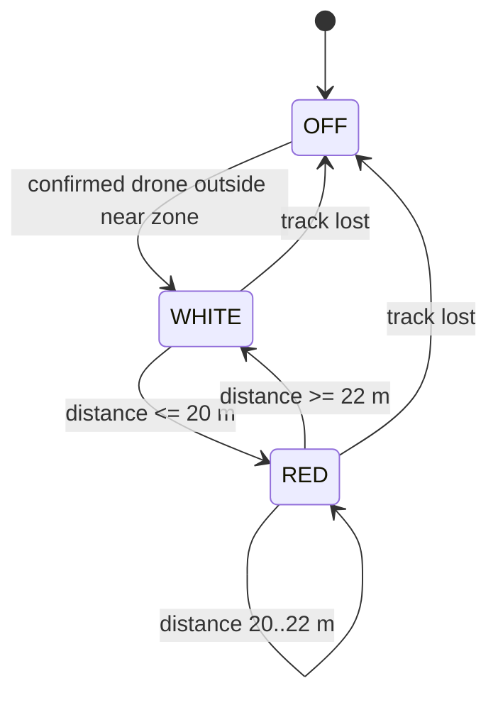

# Indicators

```mermaid
stateDiagram-v2
  [*] --> OFF
  OFF --> WHITE: confirmed drone outside near zone
  WHITE --> RED: distance <= 20 m
  RED --> RED: distance 20..22 m
  RED --> WHITE: distance >= 22 m
  WHITE --> OFF: track lost
  RED --> OFF: track lost
```

`requireApproachingForRed` optionally adds an approaching condition. Physical
GPIO is logic-level only; external lamps require a fused driver and separate
power supply.
