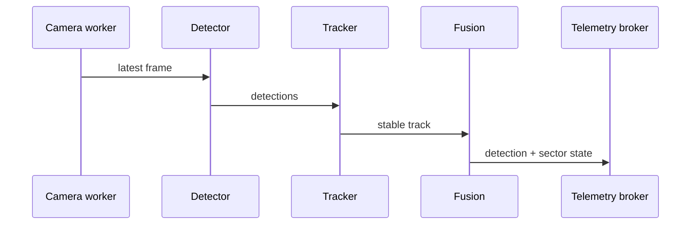

# Central-server architecture (legacy `jetson/` directory name)

`jetson/app/main.py` runs on Ubuntu VM today and may run on Jetson later. It loads YAML, starts supervised camera workers, a detector,
tracker, fusion, mock/real ESP32 transport, recording, health and two listeners:
REST 8080 and WebSocket 8081.

SIMULATOR currently uses simulated camera, mock detector/range and mock
ESP32 transport. ONNX validates model availability but requires a model-specific
output adapter. TensorRT requires JetPack and a concrete exported detector.
