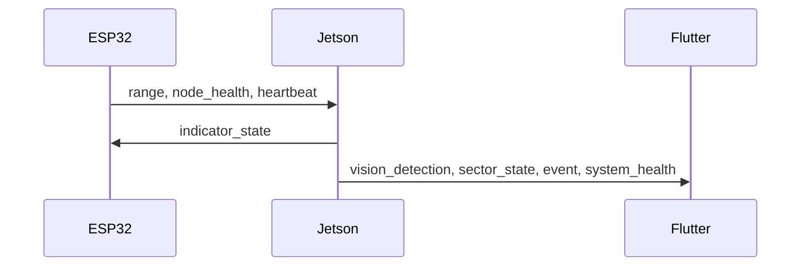

# Protocol

Protocol v1 uses UTF-8 JSON. Serial uses one object per line; WebSocket uses one
object per text frame. Required fields are `protocolVersion`, `type`, and
`timestamp`. Schema: `shared/schemas/protocol-v1.json`.

Unknown fields are ignored. Unknown protocol versions and invalid sectors are
rejected. Exact distance is null when no valid non-stale physical range exists.
