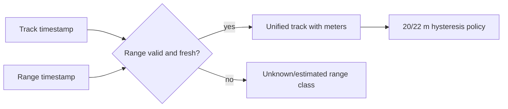

# Sensor fusion

```mermaid
flowchart LR
  T[Track timestamp] --> V{Range valid and fresh?}
  R[Range timestamp] --> V
  V -->|yes| U[Unified track with meters]
  V -->|no| E[Unknown/estimated range class]
  U --> P[20/22 m hysteresis policy]
```

The default maximum range age is 500 ms. Measurements are associated by sector.
Future multi-object/multi-range association will require spatial calibration.
