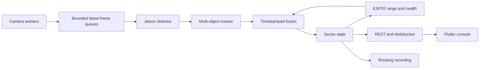
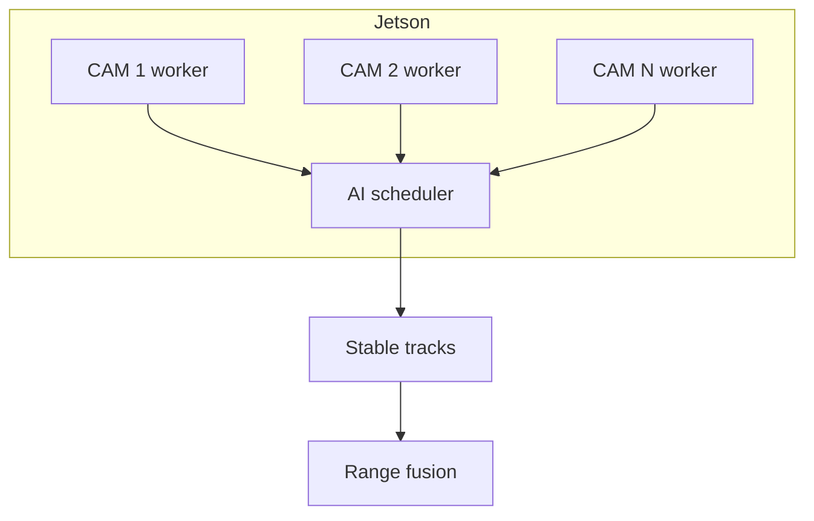

# System architecture

Ubuntu Server (or a future Jetson backend) owns detection, tracks, fusion and policy. ESP32 owns physical range I/O
and logic-level indicators. Flutter owns presentation only. Loss of Flutter does
not stop processing. Loss of Jetson causes ESP32 to stop creating new decisions
and use deterministic fallback.

